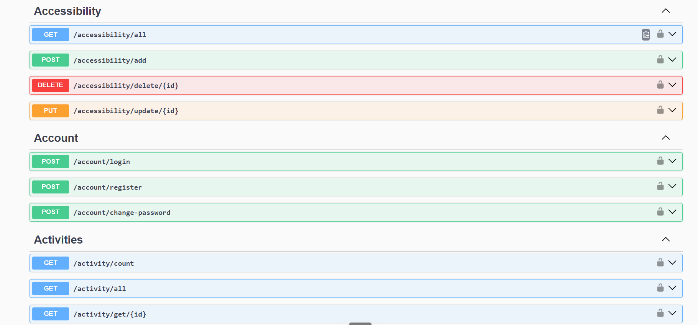
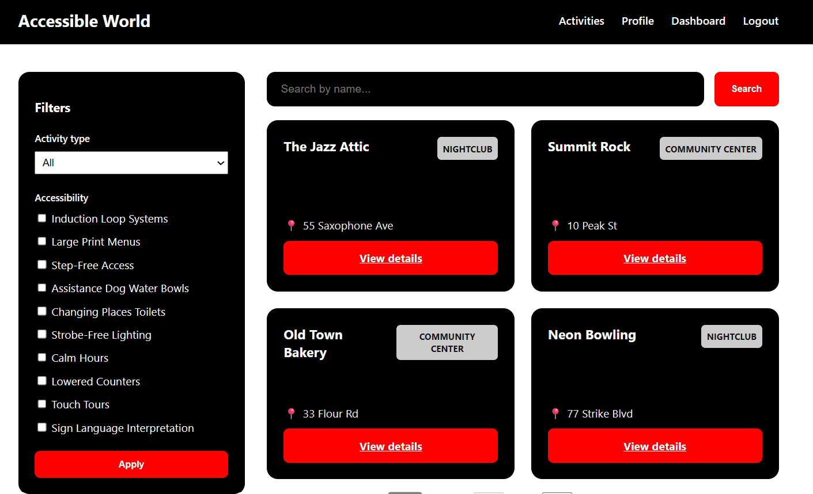
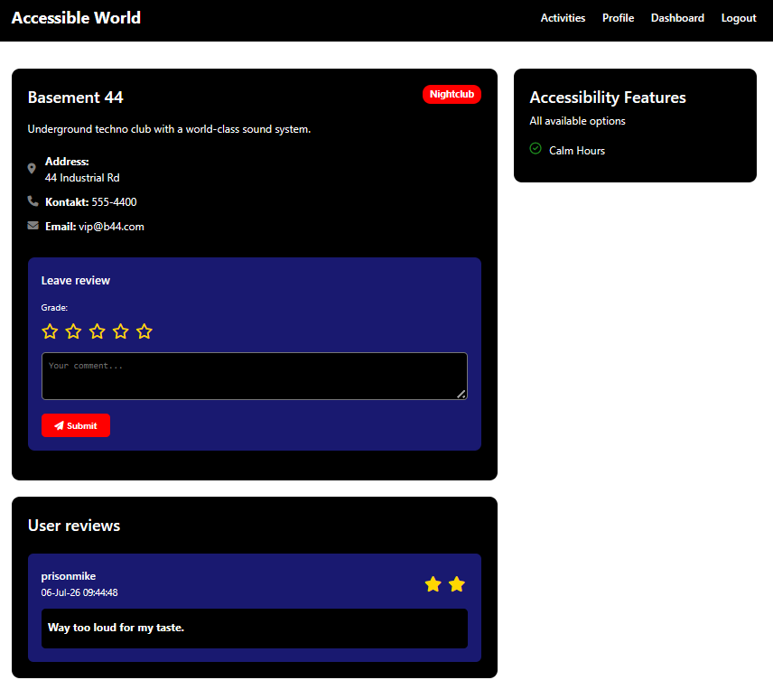

<div align="center">

# AccessibilityFinder


</div>

> **Academic project.** Built as the capstone for the *Razvoj web aplikacija* (Web Application Development) course at Algebra University. Not deployed — clone and run locally (see [Getting Started](#getting-started)).

---

## About

Demonstration of application that helps people with disabilities find activities — accommodation, restaurants, landmarks, and more — that fit their access needs. Administrators catalog activities by type and tag each one with concrete accessibility features (transport options, specialized guides, and so on); users add reviews and accessibility ratings. Accessibility is treated as a first-class, searchable dimension rather than an afterthought.

The point of the build was to implement a full multi-tier ASP.NET Core solution end to end: a JWT-secured REST API and an MVC web app sharing a business layer over a SQL Server database.

## Screenshots

| Swagger (API) | Activity list (MVC) | Details + reviews |
| ------------- | ------------------- | ----------------- |
|  |  |  |

## What This Project Demonstrates

- **RESTful API design** — CRUD, dedicated search endpoint, and server-side paging for the primary entity, with meaningful HTTP status codes (400 / 404 / 500) and error handling.
- **Authentication & authorization** — JWT issuing and validation (`register` / `login` / `change password`), role-based access separating admin and user capabilities.
- **Request logging** — every CRUD action is logged with structured entries, exposed through dedicated log endpoints and consumed by static, token-authenticated pages (JWT held in `localStorage`).
- **Relational data modelling** — a 1-to-N relationship (activity type) and an M-to-N relationship (accessibility features, via a bridge table), plus a user-action bridge for reviews/ratings.
- **Server-side validation** — required fields, format checks (URLs, emails), and duplicate-name prevention via model annotations.
- **Multi-tier architecture** — separate model sets per tier with AutoMapper handling the mapping, so database models never leak into views.
- **Database-first with SQL Server** — schema and seed data live in a single SQL script; connection strings are read from configuration, never hardcoded.

## Tech Stack

.NET 8 · ASP.NET Core (Web API + MVC) · C# · SQL Server (database-first) · JWT · Swagger / OpenAPI · AutoMapper · Razor + Bootstrap · vanilla JS / AJAX

## Project Structure

```
AccessibleFinder/
├── Database/
│   └── Database.sql              # database-first schema + seed data (single script)
└── AccessibleManager/
    ├── AccessibleManager.sln
    ├── WebAPI/                   # RESTful service — JWT-secured, Swagger UI
    ├── WebApp/                   # MVC web application
    └── ...                       # shared business + data-access layers (multi-tier)
```

## Getting Started

### Prerequisites

```bash
.NET SDK 8.0
SQL Server 2019+ (or SQL Server Express / LocalDB)
Visual Studio 2022 (or the dotnet CLI)
```

### Installation

```bash
# 1. Clone the repo
git clone https://github.com/{{USER}}/{{REPO}}.git

# 2. Navigate to the solution file
cd {{REPO}}

# 3. Run the two projects from the solution
dotnet run --project WebAPI
dotnet run --project WebApp

# 4. Open in browser
- `https://localhost:7263/swagger` 
- API & Swagger

- `https://localhost:7208`
- MVC

# Note: Both projects must run for application to work. HTTPS is required.

```

## License

Distributed under the MIT License. See `LICENSE` for details.

